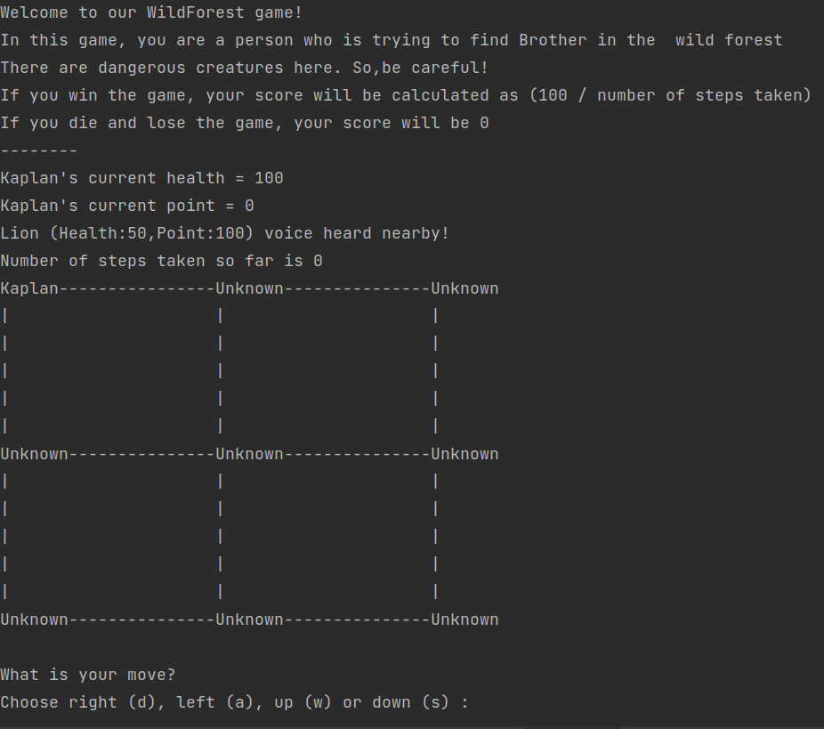

#   WILD FOREST GAME

## Introduction 

- Wild Forest is a game where user tries to find  something  in the wild forest without getting killed.
- In the game, every creature-including the user - has two abilities: health and point. These two abilities 
are very important in situations where  creatures encounter each other. Because the one with the higher 
health always wins the fight and gets the point of the lost creature but  its health is reduced.

## How to run? (Linux)

- To start the game, run the python script which is called **main.py**
- Before running the script, make sure that python interpreter is installed on your system.
- To run from command line, type `python3 main.py` in the project folder.

## Configuration

- To make any changes in the game ,you can edit the **wildForest.json** file.
- **wildForest.json** file is composited of two categories: *wildForest* and *creatures*.
- In the *wildForest* section, *rowSize* and *columnSize* can be edited.(**Only values must be edited!**)
- In the *creatures* section, creatures' attributes can be edited. (**Only values must be edited!**)

  ### Important Attributes
  - **isPlayer**: If its value equals to *True*, it indicates that creature is a player.
  - **isToBeFound**: If its value equals to *True*, it indicates that creature is the one that player must find.
  - To start the game smoothly, there must be a  player and a creature to be found.

## Screenshots

   

